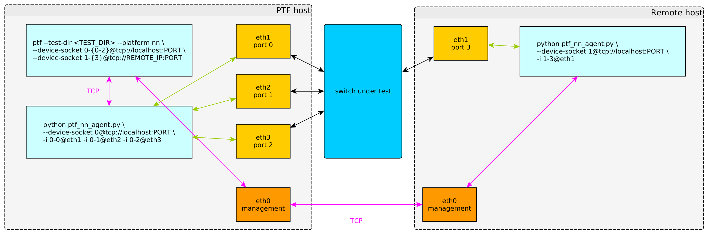

# PTF Nanomsg Agent

---

This agent is able to "bridge" a nanomsg socket with network interfaces. It can
be useful to enable PTF to send and receive packets on a remote host (i.e. not
the host running PTF).

---

## Overview

---

## Demo

Create the required 2 veth pairs (veth0-veth1 and veth2-veth3) with
`./veth_setup.sh`.

All of the following 4 steps need to be done in separate terminals. We assume
that PTF has been installed in a system location (i.e. the `ptf` binary is in
the `PATH`).

Start the first PTF agent with `sudo python ptf_nn_agent.py --device-socket
0@tcp://127.0.0.1:10001 -i 0-1@veth0`.

Start the second PTF agent with `sudo python ptf_nn_agent.py --device-socket
1@tcp://127.0.0.1:10002 -i 1-1@veth3`.

Start the dummy "test switch" with `sudo python ptf_nn_test_bridge.py -ifrom
veth1 -ito veth2`. This tool will "copy" any packet received on `veth1` to
`veth2`.

Run the PTF test with `sudo ptf --test-dir ptf_nn_test --device-socket
0-{0-64}@tcp://127.0.0.1:10001 --device-socket 1-{0-64}@tcp://127.0.0.1:10002
--platform nn`.

Now let's explain what's happening. We can consider that the first PTF agent
runs on the PTF host. The second PTF agent runs on the remote host. For each
host we need to use a separate device id (0 for the PTF host, 1 for the remote
host). The "switch" is connected to the PTF host through veth0-veth1 and to the
remote host through veth2-veth3. When running `ptf`, we need to use the `nn`
platform and provide the nanomsg TCP address for each of the 2 devices.

In our test, we send a packet to port 1 of device 0 and receive the exact same
packet on port 1 of device 1, as expected.

Of course, the remote host needs to be reachable by the PTF host, or the TCP
connection is not possible.
